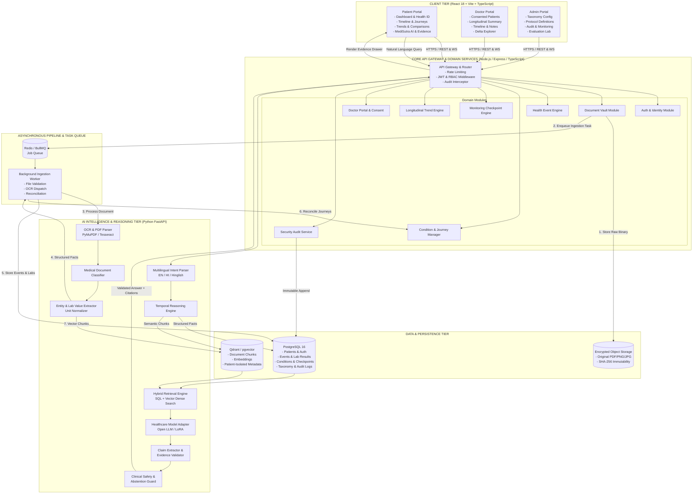
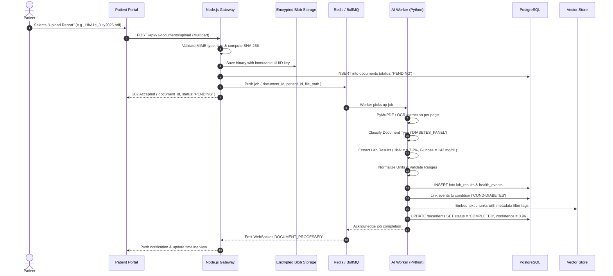
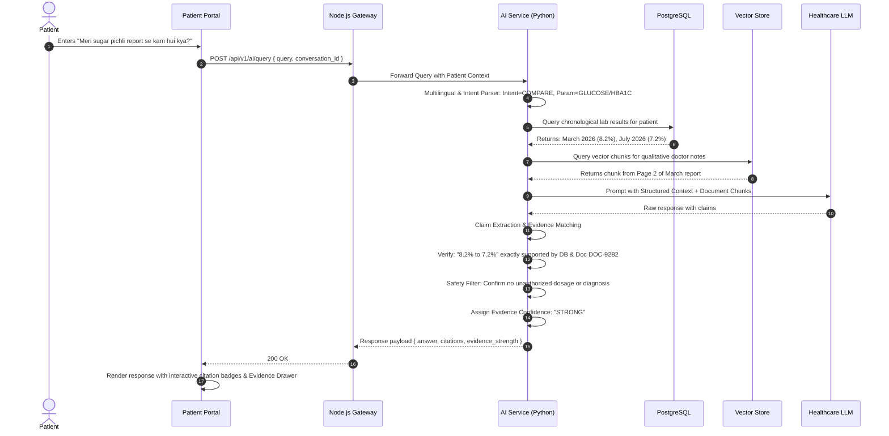

# MediSutra — System Architecture Specification

---

## 1. High-Level Technical Architecture Diagram



---

## 2. Architectural Design Principles

1. **Separation of Concerns:** 
   - Node.js/TypeScript handles deterministic business logic, database transactions, auth, and real-time frontend serving.
   - Python/FastAPI encapsulates heavy scientific processing, OCR, NLP, PyTorch/Transformers inference, vector search, and linguistic normalization.
2. **Deterministic Truth vs. Generative Explanation:**
   - Quantitative facts (e.g., *HbA1c = 7.2% on 2026-07-12*) are stored deterministically in PostgreSQL.
   - The LLM never invents numbers; it retrieves deterministic records from PostgreSQL and relevant semantic passages from Qdrant, synthesizes the narrative, and must have every statement validated by the Evidence Validator.
3. **Decoupled Asynchronous Processing:**
   - File uploads acknowledge immediately (`202 Accepted` with a `job_id`).
   - Resource-intensive OCR, entity extraction, and embedding generation execute asynchronously via a reliable queue.
   - Frontend receives real-time progress updates via WebSockets or optimistic polling.

---

## 3. Subsystem Detailed Descriptions

### 3.1 Client Tier (React 18 + Vite + TypeScript)
- **Design System:** Calm, clinical visual hierarchy using TailwindCSS and CSS variables. Employs accessible contrast ratios, minimal cognitive load, responsive layout, and distinct visual statuses.
- **State Management:** TanStack Query (React Query) for server-state caching, optimistic updates, and automatic cache invalidation on report upload.
- **Visualizations:** Recharts for longitudinal parameter curves (with normal reference range bands); custom SVG/Canvas rendering for the interactive chronological Health Timeline and Disease Journey step-trees.

### 3.2 Gateway & Domain Service Tier (Node.js / Express / TypeScript)
- **Identity & Auth Module:** Manages session lifecycle, password hashing (Argon2id), JWT issuance, and RBAC enforcement.
- **Health Event Engine:** Converts raw extracted entities into normalized `HealthEvent` instances linked to the patient timeline.
- **Condition & Journey Manager:** Maintains the state-machine lifecycle of diseases (Diagnosed → Under Treatment → Stable → Resolved) and maintains parent-child linkages between diagnoses and lab results.
- **Monitoring & Checkpoint Engine:** Cross-references active conditions against medical protocols to track expected vs. actual reports without passing medical judgment.
- **Trend & Comparison Engine:** Executes high-performance temporal aggregations on lab parameters and calculates bilateral report deltas.
- **Audit Service:** Captures every read/write event on medical entities, recording user identity, IP address, timestamp, resource ID, and action.

### 3.3 Asynchronous Ingestion & Document Intelligence Tier
1. **Validation & Hashing:** Computes SHA-256 checksum to detect duplicate uploads; validates file signatures (magic bytes).
2. **Text & Visual Extraction:**
   - For native digital PDFs: PyMuPDF extracts raw text, coordinates, and embedded tables.
   - For scanned PDFs & Images (PNG/JPG): Image pre-processing (deskew, binarization, contrast adjustment) followed by OCR via Tesseract / EasyOCR.
3. **Medical Document Classifier:** Categorizes document into standardized types (e.g., CBC, LFT, Prescription, Discharge Summary) using hybrid regex heuristics and lightweight transformer classification.
4. **Entity & Lab Normalizer:** Extracts `{ parameter, numeric_value, raw_unit, normalized_unit, ref_min, ref_max, abnormal_flag }`. Converts units to canonical standards (e.g., standardizing blood sugar units).
5. **Timeline Reconciler:** Creates structured events in PostgreSQL and triggers condition linking.

### 3.4 Medical RAG & Healthcare AI Tier
```
  [User Query] (English / Hindi / Hinglish)
         │
         ▼
  [Intent & Language Parser] ──► Extracts: Intent, Entity, Time Range, Language
         │
         ▼
  [Temporal Reasoning Engine] ──► Resolves relative terms ("last year", "before diagnosis")
         │
    ┌────┴───────────────────────────┐
    ▼                                ▼
[Structured SQL Query]       [Vector Semantic Search]
(Exact lab values, dates,    (Clinical notes, doctor
 conditions, checkpoints)     impressions, chunk text)
    └────┬───────────────────────────┘
         ▼
  [Reranker & Context Assembler]
         │
         ▼
  [Healthcare Model Adapter (LLM)]
         │
         ▼
  [Claim Extractor] ──► Extracts atomic factual assertions
         │
         ▼
  [Evidence Validator] ──► Verifies each claim against retrieved sources
         │
   ┌─────┴───────────────────────────┐
   │ All claims verified             │ Unsupported claims found
   ▼                                 ▼
[Clinical Safety Guard]      [Prune / Abstain with Warning]
         │
         ▼
[Final Validated Response + Verified Citations + Evidence Rating Badge]
```

### 3.5 Persistence & Storage Tier
- **PostgreSQL 16:** Normalized schema with UUID primary keys, temporal indexing (`CREATE INDEX idx_events_patient_date ON health_events (patient_id, event_date DESC)`), and full JSONB support for unstructured source coordinates.
- **Vector Database (Qdrant / pgvector):** Chunk embeddings (using BAAI/bge-small-en-v1.5 or all-MiniLM-L6-v2) indexed with HNSW. Every vector payload carries mandatory `{ patient_id, document_id, page_number, report_date, document_type }`. Queries strictly enforce `filter: { must: [{ key: "patient_id", match: { value: req.patientId } }] }`.
- **Encrypted Blob Storage:** Files stored with random UUID filenames on disk or S3 bucket, preventing direct URL traversal.

---

## 4. End-to-End Execution Workflows

### 4.1 Document Ingestion & Processing Flow


### 4.2 AI Query, Evidence Validation & Safety Flow

