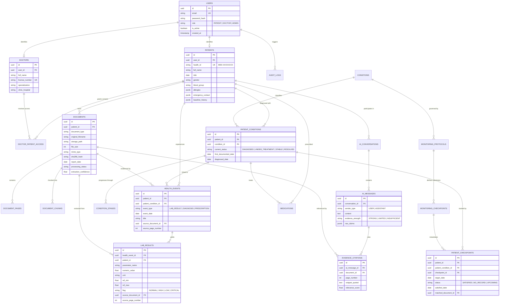

# MediSutra — Relational & Vector Database Design Specification

---

## 1. Database Entity-Relationship Diagram (ERD)



---

## 2. Table Specifications & DDL Schemas

### 2.1 Users & Authentication (`users`)
```sql
CREATE TYPE user_role_enum AS ENUM ('PATIENT', 'DOCTOR', 'ADMIN');

CREATE TABLE users (
    id UUID PRIMARY KEY DEFAULT gen_random_uuid(),
    email VARCHAR(255) UNIQUE NOT NULL,
    password_hash VARCHAR(255) NOT NULL,
    role user_role_enum NOT NULL DEFAULT 'PATIENT',
    is_active BOOLEAN NOT NULL DEFAULT TRUE,
    created_at TIMESTAMPTZ NOT NULL DEFAULT CURRENT_TIMESTAMP,
    updated_at TIMESTAMPTZ NOT NULL DEFAULT CURRENT_TIMESTAMP
);

CREATE INDEX idx_users_email ON users(email);
```

### 2.2 Patient Health Identity (`patients`)
```sql
CREATE TABLE patients (
    id UUID PRIMARY KEY DEFAULT gen_random_uuid(),
    user_id UUID UNIQUE NOT NULL REFERENCES users(id) ON DELETE CASCADE,
    health_id VARCHAR(20) UNIQUE NOT NULL, -- Format: MED-XXXXXXXX
    full_name VARCHAR(255) NOT NULL,
    dob DATE NOT NULL,
    gender VARCHAR(50),
    blood_group VARCHAR(10),
    allergies JSONB DEFAULT '[]'::jsonb, -- Array of strings e.g. ["Penicillin", "Sulfa"]
    emergency_contact JSONB DEFAULT '{}'::jsonb, -- { "name": "...", "phone": "...", "relationship": "..." }
    baseline_history JSONB DEFAULT '{}'::jsonb, -- Pre-existing conditions, familial risk factors
    created_at TIMESTAMPTZ NOT NULL DEFAULT CURRENT_TIMESTAMP,
    updated_at TIMESTAMPTZ NOT NULL DEFAULT CURRENT_TIMESTAMP
);

CREATE INDEX idx_patients_health_id ON patients(health_id);
```

### 2.3 Doctor Registry & Patient Consent (`doctors`, `doctor_patient_access`)
```sql
CREATE TABLE doctors (
    id UUID PRIMARY KEY DEFAULT gen_random_uuid(),
    user_id UUID UNIQUE NOT NULL REFERENCES users(id) ON DELETE CASCADE,
    full_name VARCHAR(255) NOT NULL,
    license_number VARCHAR(100) UNIQUE NOT NULL,
    specialization VARCHAR(150) NOT NULL,
    clinic_hospital VARCHAR(255),
    created_at TIMESTAMPTZ NOT NULL DEFAULT CURRENT_TIMESTAMP
);

CREATE TYPE consent_status_enum AS ENUM ('GRANTED', 'REVOKED', 'EXPIRED');

CREATE TABLE doctor_patient_access (
    id UUID PRIMARY KEY DEFAULT gen_random_uuid(),
    doctor_id UUID NOT NULL REFERENCES doctors(id) ON DELETE CASCADE,
    patient_id UUID NOT NULL REFERENCES patients(id) ON DELETE CASCADE,
    consent_status consent_status_enum NOT NULL DEFAULT 'GRANTED',
    granted_at TIMESTAMPTZ NOT NULL DEFAULT CURRENT_TIMESTAMP,
    expires_at TIMESTAMPTZ,
    notes TEXT,
    CONSTRAINT unique_doctor_patient_pair UNIQUE (doctor_id, patient_id)
);

CREATE INDEX idx_doctor_access ON doctor_patient_access(doctor_id, patient_id);
```

### 2.4 Document Vault & Processing (`documents`, `document_pages`, `document_chunks`)
```sql
CREATE TYPE processing_status_enum AS ENUM (
    'PENDING', 'UPLOADING', 'VALIDATED', 'OCR_PROCESSING',
    'CLASSIFYING', 'EXTRACTING', 'RECONCILING', 'COMPLETED', 'FAILED'
);

CREATE TABLE documents (
    id UUID PRIMARY KEY DEFAULT gen_random_uuid(),
    patient_id UUID NOT NULL REFERENCES patients(id) ON DELETE CASCADE,
    document_type VARCHAR(100) NOT NULL DEFAULT 'UNKNOWN',
    original_filename VARCHAR(255) NOT NULL,
    storage_path VARCHAR(512) NOT NULL,
    file_size BIGINT NOT NULL,
    mime_type VARCHAR(100) NOT NULL,
    sha256_hash CHAR(64) NOT NULL,
    report_date DATE,
    upload_date TIMESTAMPTZ NOT NULL DEFAULT CURRENT_TIMESTAMP,
    processing_status processing_status_enum NOT NULL DEFAULT 'PENDING',
    extraction_confidence NUMERIC(4,3) DEFAULT 0.000,
    error_message TEXT,
    created_at TIMESTAMPTZ NOT NULL DEFAULT CURRENT_TIMESTAMP,
    updated_at TIMESTAMPTZ NOT NULL DEFAULT CURRENT_TIMESTAMP
);

CREATE INDEX idx_documents_patient_date ON documents(patient_id, report_date DESC);
CREATE INDEX idx_documents_sha256 ON documents(sha256_hash);

CREATE TABLE document_pages (
    id UUID PRIMARY KEY DEFAULT gen_random_uuid(),
    document_id UUID NOT NULL REFERENCES documents(id) ON DELETE CASCADE,
    page_number INT NOT NULL,
    raw_text TEXT,
    ocr_confidence NUMERIC(4,3) DEFAULT 1.000,
    image_preview_path VARCHAR(512),
    CONSTRAINT unique_doc_page UNIQUE (document_id, page_number)
);

CREATE TABLE document_chunks (
    id UUID PRIMARY KEY DEFAULT gen_random_uuid(),
    document_id UUID NOT NULL REFERENCES documents(id) ON DELETE CASCADE,
    patient_id UUID NOT NULL REFERENCES patients(id) ON DELETE CASCADE,
    page_number INT NOT NULL,
    chunk_index INT NOT NULL,
    chunk_text TEXT NOT NULL,
    vector_embedding_id VARCHAR(100), -- Reference ID in Qdrant / external vector index
    metadata JSONB NOT NULL DEFAULT '{}'::jsonb
);

CREATE INDEX idx_chunks_patient ON document_chunks(patient_id);
```

### 2.5 Medical Taxonomy & Condition Journey Model
```sql
CREATE TABLE medical_taxonomy (
    id UUID PRIMARY KEY DEFAULT gen_random_uuid(),
    category_code VARCHAR(50) UNIQUE NOT NULL,
    category_name VARCHAR(100) NOT NULL,
    body_system VARCHAR(100) NOT NULL, -- Blood, Metabolic, Hepatic, Renal, Cardiovascular, Thyroid, Imaging
    description TEXT
);

CREATE TABLE conditions (
    id UUID PRIMARY KEY DEFAULT gen_random_uuid(),
    condition_code VARCHAR(50) UNIQUE NOT NULL,
    condition_name VARCHAR(150) NOT NULL,
    icd10_code VARCHAR(20),
    body_system VARCHAR(100) NOT NULL,
    description TEXT
);

CREATE TYPE condition_lifecycle_status AS ENUM (
    'RECORDED', 'SUSPECTED', 'DIAGNOSED', 'UNDER_TREATMENT',
    'MONITORING', 'IMPROVING', 'STABLE', 'RESOLVED', 'UNKNOWN'
);

CREATE TABLE patient_conditions (
    id UUID PRIMARY KEY DEFAULT gen_random_uuid(),
    patient_id UUID NOT NULL REFERENCES patients(id) ON DELETE CASCADE,
    condition_id UUID NOT NULL REFERENCES conditions(id) ON DELETE RESTRICT,
    current_status condition_lifecycle_status NOT NULL DEFAULT 'RECORDED',
    first_documented_date DATE NOT NULL,
    diagnosed_date DATE,
    resolved_date DATE,
    clinical_notes TEXT,
    created_at TIMESTAMPTZ NOT NULL DEFAULT CURRENT_TIMESTAMP,
    updated_at TIMESTAMPTZ NOT NULL DEFAULT CURRENT_TIMESTAMP,
    CONSTRAINT unique_patient_condition UNIQUE (patient_id, condition_id)
);

CREATE INDEX idx_patient_conditions_lookup ON patient_conditions(patient_id, current_status);

CREATE TYPE condition_stage_enum AS ENUM (
    'FIRST_DOCUMENTED', 'DIAGNOSIS', 'BASELINE_TESTS',
    'TREATMENT_INITIATION', 'FOLLOW_UP_MONITORING', 'LATEST_DOCUMENTED_STATE'
);

CREATE TABLE condition_stages (
    id UUID PRIMARY KEY DEFAULT gen_random_uuid(),
    patient_condition_id UUID NOT NULL REFERENCES patient_conditions(id) ON DELETE CASCADE,
    stage_type condition_stage_enum NOT NULL,
    stage_date DATE NOT NULL,
    description TEXT NOT NULL,
    source_document_id UUID REFERENCES documents(id) ON DELETE SET NULL,
    created_at TIMESTAMPTZ NOT NULL DEFAULT CURRENT_TIMESTAMP
);

CREATE INDEX idx_stages_order ON condition_stages(patient_condition_id, stage_date ASC);
```

### 2.6 Expected vs. Actual Checkpoints (`monitoring_protocols`, `patient_checkpoints`)
```sql
CREATE TABLE monitoring_protocols (
    id UUID PRIMARY KEY DEFAULT gen_random_uuid(),
    condition_id UUID NOT NULL REFERENCES conditions(id) ON DELETE CASCADE,
    protocol_name VARCHAR(150) NOT NULL,
    description TEXT
);

CREATE TABLE monitoring_checkpoints (
    id UUID PRIMARY KEY DEFAULT gen_random_uuid(),
    protocol_id UUID NOT NULL REFERENCES monitoring_protocols(id) ON DELETE CASCADE,
    checkpoint_code VARCHAR(20) NOT NULL, -- e.g. M2, M4, M6
    milestone_offset_days INT NOT NULL, -- Days from diagnosis
    required_test_parameters JSONB NOT NULL DEFAULT '[]'::jsonb, -- e.g. ["HbA1c", "Glucose Fasting"]
    description TEXT
);

CREATE TYPE checkpoint_status_enum AS ENUM ('SATISFIED', 'NO_RECORD', 'UPCOMING');

CREATE TABLE patient_checkpoints (
    id UUID PRIMARY KEY DEFAULT gen_random_uuid(),
    patient_id UUID NOT NULL REFERENCES patients(id) ON DELETE CASCADE,
    patient_condition_id UUID NOT NULL REFERENCES patient_conditions(id) ON DELETE CASCADE,
    checkpoint_id UUID NOT NULL REFERENCES monitoring_checkpoints(id) ON DELETE CASCADE,
    target_date DATE NOT NULL,
    status checkpoint_status_enum NOT NULL DEFAULT 'UPCOMING',
    satisfied_date DATE,
    matched_document_id UUID REFERENCES documents(id) ON DELETE SET NULL,
    matched_event_id UUID,
    evaluation_notes TEXT DEFAULT 'No corresponding record was found in this system.',
    updated_at TIMESTAMPTZ NOT NULL DEFAULT CURRENT_TIMESTAMP
);

CREATE INDEX idx_patient_chk ON patient_checkpoints(patient_id, status);
```

### 2.7 Health Events, Lab Results & Medications
```sql
CREATE TYPE event_type_enum AS ENUM (
    'LAB_RESULT', 'DIAGNOSIS', 'PRESCRIPTION',
    'PROCEDURE', 'CONSULTATION', 'LIFESTYLE_OBSERVATION'
);

CREATE TABLE health_events (
    id UUID PRIMARY KEY DEFAULT gen_random_uuid(),
    patient_id UUID NOT NULL REFERENCES patients(id) ON DELETE CASCADE,
    patient_condition_id UUID REFERENCES patient_conditions(id) ON DELETE SET NULL,
    event_type event_type_enum NOT NULL,
    event_date DATE NOT NULL,
    title VARCHAR(255) NOT NULL,
    summary TEXT,
    source_document_id UUID REFERENCES documents(id) ON DELETE SET NULL,
    source_page_number INT,
    extraction_confidence NUMERIC(4,3) DEFAULT 1.000,
    created_at TIMESTAMPTZ NOT NULL DEFAULT CURRENT_TIMESTAMP
);

CREATE INDEX idx_events_timeline ON health_events(patient_id, event_date DESC);

CREATE TYPE lab_flag_enum AS ENUM ('NORMAL', 'HIGH', 'LOW', 'CRITICAL');

CREATE TABLE lab_results (
    id UUID PRIMARY KEY DEFAULT gen_random_uuid(),
    health_event_id UUID NOT NULL REFERENCES health_events(id) ON DELETE CASCADE,
    patient_id UUID NOT NULL REFERENCES patients(id) ON DELETE CASCADE,
    parameter_name VARCHAR(100) NOT NULL,
    parameter_code VARCHAR(50) NOT NULL, -- e.g. HBA1C, GLU_FAST, CREATININE
    numeric_value NUMERIC(10,3),
    raw_value VARCHAR(100) NOT NULL,
    unit VARCHAR(50) NOT NULL,
    normalized_value NUMERIC(10,3),
    normalized_unit VARCHAR(50),
    reference_range_min NUMERIC(10,3),
    reference_range_max NUMERIC(10,3),
    flag lab_flag_enum NOT NULL DEFAULT 'NORMAL',
    source_document_id UUID REFERENCES documents(id) ON DELETE SET NULL,
    source_page_number INT,
    observed_date DATE NOT NULL,
    created_at TIMESTAMPTZ NOT NULL DEFAULT CURRENT_TIMESTAMP
);

CREATE INDEX idx_lab_trends ON lab_results(patient_id, parameter_code, observed_date ASC);

CREATE TABLE medications (
    id UUID PRIMARY KEY DEFAULT gen_random_uuid(),
    patient_id UUID NOT NULL REFERENCES patients(id) ON DELETE CASCADE,
    patient_condition_id UUID REFERENCES patient_conditions(id) ON DELETE SET NULL,
    medicine_name VARCHAR(255) NOT NULL,
    dosage VARCHAR(100) NOT NULL,
    frequency VARCHAR(100) NOT NULL,
    start_date DATE NOT NULL,
    end_date DATE,
    is_active BOOLEAN NOT NULL DEFAULT TRUE,
    source_document_id UUID REFERENCES documents(id) ON DELETE SET NULL,
    created_at TIMESTAMPTZ NOT NULL DEFAULT CURRENT_TIMESTAMP
);

CREATE INDEX idx_meds_patient ON medications(patient_id, is_active);
```

### 2.8 AI Conversation, Messages, and Evidence Citations
```sql
CREATE TABLE ai_conversations (
    id UUID PRIMARY KEY DEFAULT gen_random_uuid(),
    patient_id UUID NOT NULL REFERENCES patients(id) ON DELETE CASCADE,
    doctor_id UUID REFERENCES doctors(id) ON DELETE SET NULL,
    title VARCHAR(255) NOT NULL DEFAULT 'Health Record Inquiry',
    language_detected VARCHAR(20) DEFAULT 'en',
    created_at TIMESTAMPTZ NOT NULL DEFAULT CURRENT_TIMESTAMP
);

CREATE TYPE evidence_strength_enum AS ENUM ('STRONG', 'LIMITED', 'INSUFFICIENT');

CREATE TABLE ai_messages (
    id UUID PRIMARY KEY DEFAULT gen_random_uuid(),
    conversation_id UUID NOT NULL REFERENCES ai_conversations(id) ON DELETE CASCADE,
    sender_type VARCHAR(20) NOT NULL CHECK (sender_type IN ('USER', 'ASSISTANT')),
    content TEXT NOT NULL,
    evidence_strength evidence_strength_enum,
    confidence_reason TEXT,
    raw_claims JSONB DEFAULT '[]'::jsonb,
    created_at TIMESTAMPTZ NOT NULL DEFAULT CURRENT_TIMESTAMP
);

CREATE TABLE evidence_citations (
    id UUID PRIMARY KEY DEFAULT gen_random_uuid(),
    ai_message_id UUID NOT NULL REFERENCES ai_messages(id) ON DELETE CASCADE,
    document_id UUID NOT NULL REFERENCES documents(id) ON DELETE CASCADE,
    page_number INT NOT NULL,
    chunk_id UUID REFERENCES document_chunks(id) ON DELETE SET NULL,
    claim_text TEXT NOT NULL,
    snippet_quoted TEXT NOT NULL,
    relevance_score NUMERIC(4,3) DEFAULT 1.000
);

CREATE INDEX idx_citations_message ON evidence_citations(ai_message_id);
```

### 2.9 Immutable Security Audit Trail (`audit_logs`)
```sql
CREATE TABLE audit_logs (
    id UUID PRIMARY KEY DEFAULT gen_random_uuid(),
    user_id UUID REFERENCES users(id) ON DELETE SET NULL,
    patient_id UUID REFERENCES patients(id) ON DELETE SET NULL,
    action VARCHAR(100) NOT NULL, -- e.g. VIEW_DOCUMENT, RUN_AI_QUERY, ADD_CLINICAL_NOTE
    resource_type VARCHAR(100) NOT NULL,
    resource_id VARCHAR(100),
    ip_address VARCHAR(45) NOT NULL,
    user_agent TEXT,
    details JSONB DEFAULT '{}'::jsonb,
    created_at TIMESTAMPTZ NOT NULL DEFAULT CURRENT_TIMESTAMP
);

CREATE INDEX idx_audit_patient ON audit_logs(patient_id, created_at DESC);
CREATE INDEX idx_audit_user ON audit_logs(user_id, created_at DESC);
```
