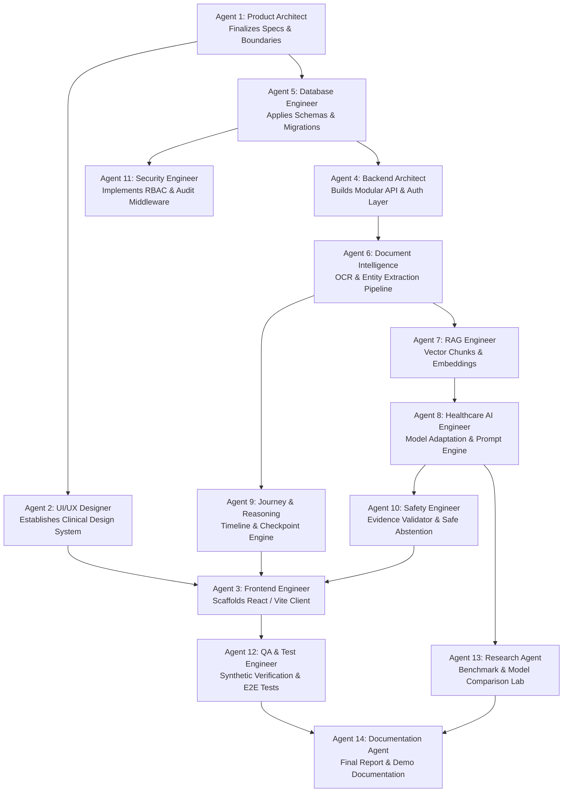

# MediSutra — Development Plan & Execution Roadmap

---

## 1. Specialized Agent Division & Responsibilities

| Agent ID | Agent Role | Core Domain & Deliverables | Primary Docs & Target Directories |
|---|---|---|---|
| **AGENT 1** | **Product Architect** | Requirements, module boundaries, clinical data models, MVP definition | `docs/product/`, `docs/REQUIREMENTS.md` |
| **AGENT 2** | **UI/UX Designer** | Clinical design system, typography, accessibility, wireframes, component design | `docs/UI_DESIGN.md`, `frontend/src/styles/` |
| **AGENT 3** | **Frontend Engineer** | React/Vite client, interactive timeline, Recharts, Evidence Drawer, responsive layouts | `frontend/src/components/`, `frontend/src/pages/` |
| **AGENT 4** | **Backend Architect** | Node.js/Express API, modular controllers, validation, transaction boundaries | `backend/src/modules/`, `backend/src/services/` |
| **AGENT 5** | **Database Engineer** | PostgreSQL schemas, migrations, temporal indexes, DDL integrity | `backend/src/database/`, `docs/DATABASE_DESIGN.md` |
| **AGENT 6** | **Document Intelligence** | PyMuPDF parser, OCR fallback, document classification, lab extractor | `ai-service/app/services/ocr_service.py` |
| **AGENT 7** | **RAG Engineer** | Chunking, BAAI embeddings, Qdrant/pgvector, patient isolation, cross-encoder | `ai-service/app/services/retrieval_service.py` |
| **AGENT 8** | **Healthcare AI Engineer** | Qwen2.5/Llama instruction adapters, LoRA training pipeline, evaluation harness | `ai-service/app/services/llm_service.py` |
| **AGENT 9** | **Journey & Reasoning** | Condition lifecycle, event linking, checkpoint reconciler, trend calculators | `backend/src/modules/journeys/`, `trends/` |
| **AGENT 10** | **Safety Engineer** | Clinical refusal guardrails, emergency alert triggers, hallucination filter | `ai-service/app/services/safety_service.py` |
| **AGENT 11** | **Security Engineer** | Argon2id auth, JWT, RBAC middleware, SHA-256 deduplication, immutable audit trail | `backend/src/middleware/rbac.ts`, `docs/SECURITY.md` |
| **AGENT 12** | **QA / Test Engineer** | Jest/Vitest unit tests, synthetic report fixtures, E2E journey verification | `tests/`, `backend/tests/` |
| **AGENT 13** | **Research Agent** | Model comparison benchmark (Models A, B, C, D), ablation logs, paper draft | `ai-service/app/evaluation/` |
| **AGENT 14** | **Documentation Agent** | Continuous sync of architectural specs, API documentation, demo guides | `README.md`, `docs/` |

---

## 2. Agent & Task Dependency Graph



---

## 3. Detailed Phase Breakdown & Milestones

### Phase 0: Architecture & Foundation Specifications *(Completed)*
- Master Project Context, System Architecture, Database Schemas, API Contract, UI Specs, Safety Rules, and Development Roadmap codified in `/docs`.

### Phase 1: Foundation (Core Backend, Database & Health Identity)
- Setup workspace directory structure (`backend/`, `frontend/`, `ai-service/`).
- PostgreSQL schema initialization & migrations.
- User registration, login, JWT token issuance, and password hashing with Argon2id.
- Digital Health ID generator (`MED-00010001`) and root demographic profile manager.
- Frontend shell with clinical design system and authentication screens.

### Phase 2: Medical Document Center & Storage Vault
- Secure document upload endpoint supporting PDF, JPG, PNG with 25MB cap.
- Magic byte validation and SHA-256 hash generation for duplicate detection.
- Encrypted file storage vault with isolated local/cloud paths.
- Document list view, file status indicators, and embedded document viewer.

### Phase 3: Document Intelligence & Normalization Pipeline
- Ingestion worker and queue integration.
- Text extraction (PyMuPDF) and OCR fallback (Tesseract).
- 18-class medical document classification.
- Extraction of numerical lab parameters, reference ranges, abnormal flags, and observation dates.
- Canonical unit normalization (e.g. standardizing mg/dL vs mmol/L).

### Phase 4: Health Event Engine & Chronological Interactive Timeline
- Transformation of extracted facts into standardized `HealthEvent` records.
- Chronological timeline API and interactive frontend visualizer.
- Multi-dimensional filtering by date range, body system, and severity flag.
- Provenance linking directly to source document ID and page number.

### Phase 5: Disease Journey Engine & Monitoring Checkpoints
- State-machine lifecycle for conditions (`RECORDED` through `RESOLVED`).
- Visual condition journey progression tree (Diagnosis → Baseline → Treatment → Follow-up).
- Configurable monitoring protocol manager (e.g., Type 2 Diabetes 3-month checkup protocol).
- Checkpoint reconciliation engine: M2, M4, M6 milestone tracking with non-judgmental messaging:
  `"No corresponding record was found in this system."`

### Phase 6: Longitudinal Analytics & Report Comparison Engine
- Time-series parameter aggregation engine (e.g. HbA1c over 24 months).
- Interactive Recharts component with normal range boundaries.
- Bilateral Report Comparison: side-by-side delta calculator (previous vs current, absolute delta, percentage change, directional indicators).

### Phase 7: Patient-Isolated Medical RAG
- Page-aware semantic chunking and dense vector embedding generation.
- Strict patient isolation filter enforcement at the vector storage layer.
- Cross-encoder reranker for top-k contextual retrieval.
- Document provenance metadata attached to every vector chunk.

### Phase 8: Healthcare AI Reasoning & Multilingual Engine
- Foundation model adapter supporting Qwen2.5 / Llama 3.
- Multilingual intent parser supporting English, Hindi, and Hinglish transliteration.
- Temporal reasoning query decomposition for relative time terms.
- Hybrid context assembly merging structured SQL lab numbers and unstructured text passages.

### Phase 9: Clinical Safety Guardrails & Evidence Validator
- Claim extraction engine decomposing raw LLM drafts into atomic factual assertions.
- Evidence Matcher verifying assertions against retrieved documents.
- Automatic pruning of unsupported assertions and safe abstention responses.
- Heuristic categorical confidence scoring (🟢 Strong, 🟡 Limited, 🔴 Insufficient).
- Strict refusal guardrails for prescriptions, dosage alterations, and emergency red-flag symptoms.

### Phase 10: Doctor Portal & Clinical Summary
- Consented patient roster and status overview.
- AI-generated longitudinal clinical summary for physicians.
- Consultation notes manager linked directly to patient timeline events.
- Patient consent management and expiration tracking.

### Phase 11: AI Research & Evaluation Lab
- 100-query synthetic patient benchmark dataset.
- Comparative evaluation suite across Model A (Commercial), Model B (Base Open), Model C (Fine-tuned), Model D (MediSutra Full System).
- Calculation of Groundedness, Citation Accuracy, Unsupported Claim Rate, Hallucination Rate, and Latency.
- Visual comparative evaluation report.

### Phase 12: Final Polish, Security Audit & Demonstration Package
- End-to-end integration testing and synthetic patient data loading.
- Comprehensive security audit of RBAC and audit logs.
- Performance optimization and production build verification.
- Demonstration script walkthrough and project documentation package.

---

## 4. Synthetic Patient Demo Scenario (Rahul Sharma, MED-10001)

To demonstrate the full power of MediSutra without using confidential patient data, a comprehensive synthetic multi-year patient record is generated:

```
PATIENT PROFILE
Name: Rahul Sharma | Health ID: MED-00010001 | DOB: 1988-04-15 | Gender: Male | Blood: B+
Allergies: Penicillin | Emergency Contact: Pooja Sharma (+91-9876543210)

TIMELINE OF SYNTHETIC RECORDS:
• 2024-03-12 (Doc-001): Routine Health Checkup → Vitamin D = 14 ng/mL (Low, Deficient).
• 2024-04-01 (Doc-002): Prescription → Cholecalciferol 60,000 IU weekly initiated.
• 2024-08-15 (Doc-003): Acute Viral Fever Episode → CBC shows WBC = 11,200 /µL (Mild elevation). Resolved in 7 days.
• 2024-09-20 (Doc-004): Follow-up Vit D Report → Vitamin D = 38 ng/mL (Normal). Condition marked RESOLVED.
• 2025-01-10 (Doc-005): Annual Executive Health Check → Fasting Glucose = 165 mg/dL (High).
• 2025-01-22 (Doc-006): Confirmatory Diagnostic Panel → HbA1c = 8.7% (High). Type 2 Diabetes Confirmed.
• 2025-02-01 (Doc-007): Prescription → Metformin 500mg BID initiated.
• 2025-03-20 (Doc-008, M2 Checkpoint): Follow-up Lab Report → HbA1c = 8.2%, Fasting Glucose = 152 mg/dL.
• [M4 Checkpoint: 2025-05-22]: NO RECORD IN SYSTEM (Demonstrates non-judgmental missing record detection).
• 2025-07-28 (Doc-009, M6 Checkpoint): Follow-up Lab Report → HbA1c = 7.8%, Fasting Glucose = 144 mg/dL.
• 2026-01-14 (Doc-010): Annual Diabetes Review → HbA1c = 7.2%, Lipid Profile Normal, Creatinine 0.9 mg/dL.
• 2026-07-12 (Doc-011): Latest Documented State → HbA1c = 6.9%, Fasting Glucose = 138 mg/dL. Condition: STABLE.
```

---

## 5. Technical Risk Matrix & Mitigation Strategies

| Risk Item | Likelihood / Impact | Proactive Mitigation Strategy |
|---|---|---|
| **Low-Quality Mobile Photo Scans of Paper Reports** | High / High | Dual-pipeline OCR: Try digital PDF direct extraction first; if text layer empty, run image pre-processing (OpenCV deskew, adaptive binarization) before Tesseract OCR. Compute page-level OCR confidence. |
| **Heterogeneous Report Layouts Across Indian Diagnostic Labs** | High / Medium | Hybrid extractor: Regex-based key-value pattern matching for standard lab parameters combined with few-shot LLM parsing for unstructured tables. Standardize all parameters to canonical taxonomy codes. |
| **LLM Hallucination of Quantitative Lab Numbers** | Medium / Critical | Strict architectural separation: Quantitative lab values are retrieved exclusively from deterministic PostgreSQL records and injected directly into prompt context. Post-generation Evidence Validator prunes any generated number not present in the structured context. |
| **Cross-Lingual Hinglish Semantic Ambiguity** | Medium / Medium | Dedicated phonetic normalization dictionary and few-shot intent classification mapping colloquial Hinglish keywords (`sugar kam hui kya`, `bp check`, `hb`) to canonical parameters before database querying. |
| **LLM Inference Latency Degrading Chat UX** | Medium / Low | Stream conversational text via Server-Sent Events (SSE) while asynchronous evidence validator verifies citations in parallel. Display immediate structured card components for instant visual feedback. |
