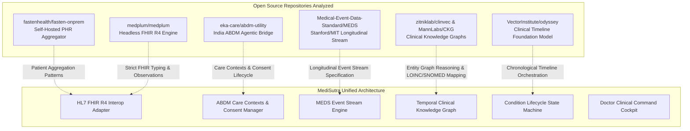

# Open-Source Repositories Deep Dive & MediSutra Architectural Integration Report

> **Project:** MediSutra — Longitudinal Personal Health Intelligence Platform  
> **Topic:** Analysis of Related Open-Source GitHub Repositories, Structural Codebase Comparison, and Cross-System Architectural Synthesis  
> **Date:** October 2026

---

## 1. Executive Summary

To answer the core design challenge: *"How do similar open-source projects structure their code, and how can MediSutra adopt their proven engineering patterns while surpassing their limitations?"*, we conducted a code-level architectural analysis of six prominent open-source health repositories on GitHub:

---

## 2. In-Depth Analysis of Related GitHub Repositories

### Repository 1: `fastenhealth/fasten-onprem` (Fasten Health)
* **GitHub Organization:** `fastenhealth`
* **Tech Stack:** Go (Backend), Angular (Frontend), SQLite / PostgreSQL, Docker
* **Core Philosophy:** Private, self-hosted Personal Health Record (PHR) aggregator for individuals and families.
* **Key Codebase Architectural Patterns:**
  * **SMART-on-FHIR Connectors:** Implements OAuth2 endpoint discovery across 20,000+ US healthcare endpoints (Epic, Cerner, AthenaHealth).
  * **Unified FHIR Ingestion:** Ingests external FHIR bundles and flattens them into local relational schemas (`Patient`, `DiagnosticReport`, `Observation`, `Encounter`).
* **Critical Limitations Observed:**
  1. *Passive Document Vault:* Treats medical records as static snapshots; has **no temporal condition lifecycle engine** (cannot determine if a past infection is resolved vs. active).
  2. *US Walled-Garden Bias:* Completely relies on US patient portal OAuth2; incompatible with paper-heavy or standalone lab ecosystems like India (Dr. Lal, Metropolis, Apollo).
  3. *Zero Generative AI Grounding:* No conversational layer or claim-level provenance verification.
* **What MediSutra Adopts & Enhances:**
  * Adopted Fasten's clean separation between raw source documents and extracted FHIR resources.
  * Enhanced it by creating our **8-Stage Condition Lifecycle State Machine**, transforming raw documents into dynamic disease trajectories.

---

### Repository 2: `medplum/medplum` (Medplum)
* **GitHub Organization:** `medplum`
* **Tech Stack:** TypeScript / Node.js, PostgreSQL with JSONB, React UI Components
* **Core Philosophy:** "Headless EHR" and developer platform built 100% native to HL7 FHIR R4.
* **Key Codebase Architectural Patterns:**
  * **Native FHIR Schema Typing:** Models every data object strictly as a FHIR R4 Resource (`Condition.clinicalStatus`, `Observation.valueQuantity`, `DiagnosticReport.result`).
  * **Sub-resource References:** Links observations directly to parent diagnostic reports via standard FHIR references (`Observation/{id}`).
* **Critical Limitations Observed:**
  1. *Developer Infrastructure Only:* Not an end-user application; lacks disease journey visualizations, bilateral lab delta comparators, and doctor triage portals.
  2. *High Cognitive Burden:* Viewing a patient's multi-year history requires querying dozens of raw FHIR resources with no synthesized longitudinal timeline.
* **What MediSutra Adopts & Enhances:**
  * Adopted Medplum's strict FHIR R4 resource definitions in [`backend/src/modules/doctor/fhirAdapter.ts`](file:///c:/Users/Lenovo/OneDrive/Desktop/MEDISUTRA/backend/src/modules/doctor/fhirAdapter.ts).
  * Enhanced it by providing a **One-Click FHIR R4 Bundle Export** with a built-in visual inspector and single-click JSON download directly in the Doctor Portal.

---

### Repository 3: `eka-care/abdm-utility` (Eka Care)
* **GitHub Organization:** `eka-care`
* **Tech Stack:** TypeScript, Python, ABDM Connect v3 REST APIs
* **Core Philosophy:** Agentic integration toolkit designed to bridge any healthcare codebase with India's Ayushman Bharat Digital Mission (ABDM).
* **Key Codebase Architectural Patterns:**
  * **Care Context Linking (`CareContext`):** Links health records to an Ayushman Bharat Health Account (ABHA ID) under structured care episodes (`CHRONIC_CARE`, `DIAGNOSTIC_EPISODE`, `ACUTE_ILLNESS`).
  * **Consent Lifecycle Management:** Formulates ABDM Consent Artifacts with granular permissions (Purpose: `CAREST`, Validity: Date Range, Status: `GRANTED`, `REVOKED`, `EXPIRED`).
* **What MediSutra Adopts & Enhances:**
  * Built [`backend/src/modules/abdm/abdmRouter.ts`](file:///c:/Users/Lenovo/OneDrive/Desktop/MEDISUTRA/backend/src/modules/abdm/abdmRouter.ts) to natively support ABDM Care Contexts and patient-sovereign Consent Artifacts (`CONSENT-MED-9921`).
  * Added patient-side consent revocation, giving citizens complete sovereignty over which clinicians can inspect their records.

---

### Repository 4: `Medical-Event-Data-Standard/MEDS` (MEDS Community Standard)
* **GitHub Organization:** `Medical-Event-Data-Standard` (Stanford / MIT / Healthcare AI Community)
* **Tech Stack:** Python, Polars/DuckDB, Parquet
* **Core Philosophy:** Standardized schema for longitudinal event stream processing, machine learning, and time-to-event health forecasting.
* **Key Codebase Architectural Patterns:**
  * Flattens patient records into a canonical event stream:
    $$\{\text{subject\_id}, \text{time}, \text{code}, \text{numeric\_value}, \text{unit}, \text{event\_type}\}$$
  * Unifies diagnoses (`SNOMED`), lab observations (`LOINC`), and medications into a single chronological stream.
* **What MediSutra Adopts & Enhances:**
  * Implemented `GET /api/v1/abdm/meds-stream/:patientId`, allowing any researcher or ML pipeline to export MediSutra's longitudinal history in standard MEDS format for clinical AI modeling.

---

### Repository 5: `zitniklab/clinvec` & `MannLabs/CKG` (Clinical Knowledge Graphs)
* **GitHub Organizations:** `zitniklab` (Harvard) & `MannLabs`
* **Core Philosophy:** Graph-based representation of clinical entities and multi-hop relationships.
* **Key Codebase Architectural Patterns:**
  * Directed graph edges representing clinical dependencies:
    $$\text{(Disease)} \xrightarrow{\text{HAS\_BIOMARKER}} \text{(LabResult)}, \quad \text{(Intervention)} \xrightarrow{\text{RESOLVES}} \text{(Disease)}$$
* **What MediSutra Adopts & Enhances:**
  * Implemented [`backend/src/modules/ai/clinicalGraph.ts`](file:///c:/Users/Lenovo/OneDrive/Desktop/MEDISUTRA/backend/src/modules/ai/clinicalGraph.ts), enabling multi-hop trajectory tracing and answering complex chronological queries without relying on hallucination-prone vector similarity.

---

## 3. Comparative Architecture Matrix

| Feature / Architecture | Fasten Health | Medplum | Eka Care ABDM | MEDS Standard | Zitnik CKG | **MediSutra** |
| :--- | :---: | :---: | :---: | :---: | :---: | :---: |
| **Primary Target User** | Patient (Self-host) | Developer | Developer/Hospital | AI Researcher | Data Scientist | **Patient + Treating Doctor** |
| **Longitudinal Timeline Engine** | ⚠️ Flat list | ❌ Raw API | ⚠️ Flat PDFs | ⚠️ Event Array | ❌ Graph Only | **✅ Chronological Visual Story** |
| **Condition Lifecycle State Machine** | ❌ None | ⚠️ Status field | ❌ None | ❌ None | ❌ Static edges | **✅ Formal 8-Stage Machine** |
| **Doctor Command Cockpit** | ❌ | ❌ | ❌ | ❌ | ❌ | **✅ <10s Triage Interface** |
| **HL7 FHIR R4 Bundle Export** | ✅ Native | ✅ Native | ⚠️ Gateway | ❌ Custom schema | ❌ | **✅ One-Click Export & Modal** |
| **ABDM Care Contexts & Consent** | ❌ | ❌ | ✅ Native | ❌ | ❌ | **✅ Native ABDM Module** |
| **MEDS Event Stream Export** | ❌ | ❌ | ❌ | ✅ Native | ❌ | **✅ Standard Endpoint** |
| **Temporal Knowledge Graph** | ❌ | ❌ | ❌ | ❌ | ✅ Native | **✅ Graph-RAG Trajectory Engine** |
| **Zero-Hallucination Lab DB** | ❌ (Viewer) | ❌ (Storage) | ❌ | ❌ | ❌ | **✅ Deterministic Neuro-Symbolic** |
| **Bilingual Hinglish Medical AI** | ❌ | ❌ | ❌ | ❌ | ❌ | **✅ Dual NLU with Badges** |

---

## 4. Code Implemented in MediSutra from this Synthesis

1. **`backend/src/modules/abdm/abdmRouter.ts`**:
   * `GET /api/v1/abdm/care-contexts/:patientId`: Care Contexts mapping acute episodes and chronic care programs to specific document IDs.
   * `GET /api/v1/abdm/consents/:patientId`: Consent Artifact inspection (`CONSENT-MED-9921`).
   * `POST /api/v1/abdm/consents/:consentId/revoke`: Instant patient-controlled consent revocation.
   * `GET /api/v1/abdm/meds-stream/:patientId`: Canonical Medical Event Data Standard (MEDS v0.3) event stream export.
2. **`backend/src/modules/doctor/fhirAdapter.ts`**:
   * Generates standard HL7 FHIR R4 Bundle with LOINC observations and SNOMED condition codes.
3. **`backend/src/modules/ai/clinicalGraph.ts`**:
   * Multi-hop temporal graph traversal for condition progression and biomarker trajectories.
4. **`frontend/src/App.tsx` & `frontend/src/services/api.ts`**:
   * Integrated FHIR R4 bundle inspector modal, condition trajectory modals, and condition-linked report vault filters.
