# MediSutra — UI/UX Design System & Page Hierarchy Specification

---

## 1. Design System Foundations

The visual experience of MediSutra is designed to instill **trust, clinical clarity, and emotional calmness**. It avoids distracting neon gradients, unnecessary heavy animations, and cluttered multi-card grids.

### 1.1 Color Palette & Semantic Meaning

```css
:root {
  /* Surface & Neutrals */
  --color-bg-app: #F8FAFC;         /* Calm clinical off-white */
  --color-surface-card: #FFFFFF;    /* Crisp card surface */
  --color-surface-subtle: #F1F5F9;  /* Secondary background */
  --color-border: #E2E8F0;          /* Clean subtle border */
  
  /* Text & Typography */
  --color-text-primary: #0F172A;    /* Deep slate for high legibility */
  --color-text-secondary: #475569;  /* Muted secondary body text */
  --color-text-tertiary: #94A3B8;   /* Subtle metadata & hints */

  /* Semantic Health Status Tokens */
  --color-status-neutral: #3B82F6;  /* Informational / Active state (Soft Blue) */
  --color-status-success: #059669;  /* Documented Normal / Resolved (Emerald Green) */
  --color-status-warning: #D97706;  /* Attention Needed / Limited Evidence (Warm Amber) */
  --color-status-danger: #DC2626;   /* Critical Value / Emergency Warning (Crimson Red) */
  --color-brand-primary: #0F766E;   /* Deep Medical Teal (Primary Identity) */
  --color-brand-accent: #14B8A6;    /* Vibrant Teal for interactive focus */
}
```

### 1.2 Core UX Axiom
Every patient dashboard screen must answer three questions at a glance:
1. **What is my health record?** (Active conditions, medications, latest reports).
2. **What has changed?** (Longitudinal trends, deltas since last checkup, recent events).
3. **Where did this information come from?** (Clickable document source and page citations).

---

## 2. Frontend Page Hierarchy (Sitemap)

```mermaid
graph TD
    ROOT[MediSutra Web Portal]
    
    subgraph AuthPortal ["Public / Auth Flow"]
        ROOT --> LOGIN[Login Screen]
        ROOT --> REGISTER[Register & Health Identity Onboarding]
    end

    subgraph PatientApp ["Patient Portal (/patient)"]
        ROOT --> P_DASH[Patient Dashboard\n- Health ID Card\n- Active vs Resolved Stats\n- Quick Timeline Preview\n- Latest Reports]
        
        P_DASH --> P_DOCS[Document Center\n- Secure Upload Modal\n- Processing Status Queue\n- Document Viewer & Pages\n- Extracted Entities Inspector]
        
        P_DASH --> P_TIME[Chronological Health Timeline\n- Multi-system Body Filter\n- Event Type Filter\n- Severity Tags\n- Source Document Links]
        
        P_DASH --> P_COND[Condition Manager & Disease Journeys\n- Condition Overview\n- Journey Stage Timeline\n- Expected vs Actual Checkpoints\n- Linked Reports & Meds]
        
        P_DASH --> P_TRND[Longitudinal Analytics\n- Interactive Lab Trends\n- Reference Range Overlays\n- Bilateral Report Comparator]
        
        P_DASH --> P_AI[MediSutra AI Assistant\n- Health History Q&A\n- Hindi/Hinglish Query Parser\n- Evidence Drawer & Citations\n- Quick Action Prompts]
        
        P_DASH --> P_PROF[Profile & Consent Management\n- Demographics & Emergency Info\n- Doctor Access Consent List]
    end

    subgraph DoctorApp ["Doctor Portal (/doctor)"]
        ROOT --> D_ROSTER[Consented Patients Roster\n- Active Conditions\n- Last Encounter\n- Status Flags]
        
        D_ROSTER --> D_OVERVIEW[Patient Clinical Overview\n- Longitudinal AI Summary\n- Timeline & Journey Inspect\n- Multi-report Delta View\n- Consultation Notes Drawer]
    end

    subgraph AdminApp ["Admin Portal (/admin)"]
        ROOT --> A_TAXONOMY[Medical Taxonomy & Range Manager]
        ROOT --> A_PROTOCOLS[Condition Monitoring Protocol Editor]
        ROOT --> A_AUDIT[Immutable Security Audit Viewer]
        ROOT --> A_EVAL[AI Evaluation Lab & Benchmarks]
    end
```



---

## 3. Screen Layouts & Wireframes

### 3.1 Patient Home Dashboard (`/patient/dashboard`)
```text
┌────────────────────────────────────────────────────────────────────────┐
│ [Logo] MediSutra         [Timeline] [Conditions] [Reports] [AI] [User] │
├────────────────────────────────────────────────────────────────────────┤
│ Good morning, Rahul Sharma                                             │
│ Health Identity: MED-00010001 • Blood Group: B+ • Age: 38              │
├────────────────────────────────────────────────────────────────────────┤
│  ┌─────────────────┐  ┌─────────────────┐  ┌─────────────────┐         │
│  │ ACTIVE COND.    │  │ RESOLVED COND.  │  │ TOTAL REPORTS   │         │
│  │       2         │  │        1        │  │       14        │         │
│  │ Diabetes, Vit D │  │ Viral Infection │  │ Last: 12 Jul 26 │         │
│  └─────────────────┘  └─────────────────┘  └─────────────────┘         │
├────────────────────────────────────────────────────────────────────────┤
│ CURRENT DOCUMENTED HEALTH STATE                                        │
│ • Glycemic: HbA1c 7.2% (Trending Down from 8.7%)                       │
│ • Blood Pressure: 124/82 mmHg (Documented Normal)                      │
│ • Active Medications: Metformin 500mg BID                              │
├────────────────────────────────────────────────────────────────────────┤
│ HEALTH TIMELINE PREVIEW                                  [View All →]  │
│ 2024 ─────────────────────── 2025 ─────────────────────── 2026         │
│  ● Viral Fever (Aug)         ● Diabetes Diag (Jan)       ● Follow-up   │
│  ● Vitamin D Def (Mar)       ● Metformin Start (Feb)     ● HbA1c 7.2%  │
├────────────────────────────────────────────────────────────────────────┤
│ QUICK ACTIONS:                                                         │
│ [ + Upload New Report ]    [ Compare Reports ]    [ Ask MediSutra AI ] │
└────────────────────────────────────────────────────────────────────────┘
```

### 3.2 Condition Disease Journey & Checkpoint Tracker (`/patient/conditions/:id`)
```text
┌────────────────────────────────────────────────────────────────────────┐
│ ← Back to Conditions                                                   │
│ TYPE 2 DIABETES MELLITUS                                               │
│ Status: UNDER MANAGEMENT • First Documented: 22 Jan 2025               │
├────────────────────────────────────────────────────────────────────────┤
│ DISEASE JOURNEY STAGES                                                 │
│                                                                        │
│ 22 Jan 2025  ● Confirmed Diagnosis (HbA1c 8.7%)            [View Doc] │
│                    │                                                   │
│                    ▼                                                   │
│ 01 Feb 2025  ● Treatment Commenced (Metformin 500mg BID)   [View Doc] │
│                    │                                                   │
│                    ▼                                                   │
│ 20 Mar 2025  ● Follow-up Checkup (HbA1c 8.2%)              [View Doc] │
│                    │                                                   │
│                    ▼                                                   │
│ 12 Jul 2026  ● Latest Documented Status (HbA1c 7.2%)        [View Doc] │
├────────────────────────────────────────────────────────────────────────┤
│ CONFIGURED MONITORING PROTOCOL CHECKPOINTS                             │
│ Protocol: Standard 3-Month Diabetes Glycemic Monitoring                │
│                                                                        │
│ M2 (Month 2)    ● AVAILABLE    (Documented on 20 Mar 2025)  [Doc-004]  │
│ M4 (Month 4)    ▲ NO CORRESPONDING RECORD IN THIS SYSTEM               │
│ M6 (Month 6)    ● AVAILABLE    (Documented on 28 Jul 2025)  [Doc-006]  │
│ Latest          ● AVAILABLE    (Documented on 12 Jul 2026)  [Doc-012]  │
└────────────────────────────────────────────────────────────────────────┘
```

### 3.3 MediSutra AI Assistant & Evidence Drawer (`/patient/ai`)
```text
┌────────────────────────────────────────────────────────────────────────┐
│ MediSutra AI — Longitudinal Health Assistant                           │
│ Ask any question in English, Hindi, or Hinglish                        │
├────────────────────────────────────────────────────────────────────────┤
│ Quick Suggestions:                                                     │
│ [ Meri sugar pichli report se kam hui kya? ] [ Summarize my history ]  │
│ [ Compare 2025 and 2026 reports ]            [ Missing checkpoints ]   │
├────────────────────────────────────────────────────────────────────────┤
│ Patient: "Meri sugar pichli report se kam hui kya?"                    │
│                                                                        │
│ MediSutra AI:                                                          │
│ Haan Rahul, aapke documents ke mutabik aapki sugar kam hui hai.        │
│ March 2026 mein aapka HbA1c 8.2% darj tha, jabki July 2026 ki report   │
│ mein HbA1c 7.2% darj hai (1.0% ki giraavat).                           │
│                                                                        │
│ 🟢 Evidence Strength: STRONG                                           │
│ Verified against 2 independent clinical reports.                       │
│                                                                        │
│ SOURCE CITATIONS:                                                      │
│ ┌────────────────────────────────────────────────────────────┐         │
│ │ [📄 DOC-004: March 2025 Lab Report • Page 2]               │         │
│ │ "HbA1c: 8.2% (High) | Fasting Glucose: 165 mg/dL"          │         │
│ └────────────────────────────────────────────────────────────┘         │
│ ┌────────────────────────────────────────────────────────────┐         │
│ │ [📄 DOC-012: July 2026 Follow-up Report • Page 1]          │         │
│ │ "HbA1c: 7.2% (Target < 7.0%) | Fasting Glucose: 142 mg/dL" │         │
│ └────────────────────────────────────────────────────────────┘         │
│                                                                        │
│ ⚠ Disclaimer: This summary is based strictly on documented records in   │
│ your MediSutra profile. Do not alter dosage without consulting doctor. │
├────────────────────────────────────────────────────────────────────────┤
│ [ Ask a question about your health records...           ] [ Send ➔ ]   │
└────────────────────────────────────────────────────────────────────────┘
```
